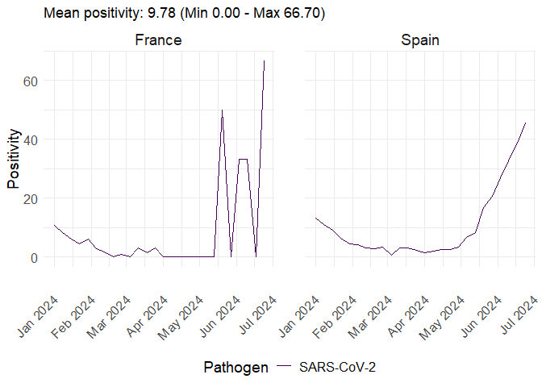

<!-- README.md is generated from README.Rmd. Please edit that file -->

# ervissexplore

<!-- badges: start -->

[](https://github.com/Epiconcept-Paris/ervissexplore/actions/)[](https://epiconcept-paris.github.io/ervissexplore/)
<!-- badges: end -->

An R package to easily retrieve ERVISS (European Respiratory Virus
Surveillance Summary) data from the EU-ECDC. Provides functions to
fetch, filter, and optionally visualize respiratory virus surveillance
data across European countries.

Please visit <https://erviss.org/> for a detailed description of the
underlying data (see ‘Methods’ in the footer).

## Installation

**From CRAN**

``` r
install.packages("ervissexplore")
```

**Development version from Github**

``` r
install.packages("pak")
pak::pak("Epiconcept-Paris/ervissexplore")
```

## Quick Start

``` r
library(ervissexplore)

# Retrieve SARS-CoV-2 positivity data
positivity_data <- get_sentineltests_positivity(
  date_min = as.Date("2024-01-01"),
  date_max = as.Date("2024-12-31"),
  pathogen = "SARS-CoV-2",
  countries = c("France", "Germany", "Italy")
)

head(positivity_data)
#>                 survtype countryname yearweek   pathogen pathogentype
#>                   <char>      <char>   <char>     <char>       <char>
#> 1: primary care sentinel      France 2024-W52 SARS-CoV-2   SARS-CoV-2
#> 2: primary care sentinel      France 2024-W52 SARS-CoV-2   SARS-CoV-2
#> 3: primary care sentinel      France 2024-W52 SARS-CoV-2   SARS-CoV-2
#> 4: primary care sentinel      France 2024-W51 SARS-CoV-2   SARS-CoV-2
#> 5: primary care sentinel      France 2024-W51 SARS-CoV-2   SARS-CoV-2
#> 6: primary care sentinel      France 2024-W51 SARS-CoV-2   SARS-CoV-2
#>    pathogensubtype  indicator    age value       date
#>             <char>     <char> <char> <num>     <Date>
#> 1:      SARS-CoV-2 detections  total   3.0 2024-12-23
#> 2:      SARS-CoV-2 positivity  total   2.1 2024-12-23
#> 3:      SARS-CoV-2      tests  total 142.0 2024-12-23
#> 4:      SARS-CoV-2 detections  total  13.0 2024-12-16
#> 5:      SARS-CoV-2 positivity  total   4.1 2024-12-16
#> 6:      SARS-CoV-2      tests  total 319.0 2024-12-16
```

## Data Sources

The package fetches data directly from the [EU-ECDC Respiratory Viruses
Weekly Data](https://github.com/EU-ECDC/Respiratory_viruses_weekly_data)
repository.

Seven data sources are available:

| Data source | Function | Description |
|----|----|----|
| Sentinel positivity | `get_sentineltests_positivity()` | Test positivity rates by pathogen |
| SARS-CoV-2 variants | `get_erviss_variants()` | Variant proportions and detections |
| ILI/ARI rates | `get_ili_ari_rates()` | ILI/ARI consultation rates by age group |
| SARI rates | `get_sari_rates()` | SARI hospitalisation rates by age group |
| SARI virological | `get_sari_positivity()` | SARI tests, detections and positivity |
| Non-sentinel severity | `get_nonsentinel_severity()` | Deaths, hospital and ICU admissions |
| Non-sentinel tests | `get_nonsentinel_tests()` | Non-sentinel tests and detections |

A generic function `get_erviss_data(type = ...)` can also be used to
access any of the above sources.

### Latest Data vs Snapshots

By default, functions fetch the latest available data. For
reproducibility, you can use historical snapshots:

``` r
# Use a specific snapshot for reproducible analyses
data <- get_sentineltests_positivity(
  date_min = as.Date("2023-01-01"),
  date_max = as.Date("2023-12-31"),
  use_snapshot = TRUE,
  snapshot_date = as.Date("2024-02-23")
)
```

To see available snapshot dates, visit the [EU-ECDC Respiratory Viruses
Weekly Data
repository](https://github.com/EU-ECDC/Respiratory_viruses_weekly_data/tree/main/data/snapshots).

** Please be aware that data are subject to retrospective update at any time.**

## Examples

### Retrieve and analyze data

``` r
# Get positivity data (returns a data.table)
data <- get_sentineltests_positivity(
  date_min = as.Date("2024-01-01"),
  date_max = as.Date("2024-06-30"),
  pathogen = c("SARS-CoV-2", "Influenza"),
  countries = c("France", "Spain", "Italy"),
  indicator = "positivity"
)

# Your own analysis with data.table syntax
data[,
  .(
    min_positivity = min(value, na.rm = TRUE),
    mean_positivity = mean(value, na.rm = TRUE),
    max_positivity = max(value, na.rm = TRUE)
  ),
  by = .(countryname, pathogen)
]
#>    countryname   pathogen min_positivity mean_positivity max_positivity
#>         <char>     <char>          <num>           <num>          <num>
#> 1:      France  Influenza            0.0       19.223077           58.7
#> 2:      France SARS-CoV-2            0.0        8.942308           66.7
#> 3:       Italy  Influenza            0.6       12.670588           40.5
#> 4:       Italy SARS-CoV-2            0.0        2.247059           10.4
#> 5:       Spain  Influenza            0.2        7.361538           43.7
#> 6:       Spain SARS-CoV-2            0.8       10.626923           45.6
```

### Other data sources

``` r
# ILI consultation rates
ili_data <- get_ili_ari_rates(
  date_min = as.Date("2024-01-01"),
  date_max = as.Date("2024-12-31"),
  indicator = "ILIconsultationrate",
  age = c("0-4", "65+"),
  countries = "France"
)

# Hospital admissions
severity_data <- get_nonsentinel_severity(
  date_min = as.Date("2024-01-01"),
  date_max = as.Date("2024-12-31"),
  pathogen = "SARS-CoV-2",
  indicator = "hospitaladmissions",
  countries = c("France", "Spain")
)

# SARI positivity
sari_data <- get_sari_positivity(
  date_min = as.Date("2024-01-01"),
  date_max = as.Date("2024-12-31"),
  pathogen = "Influenza",
  indicator = "positivity",
  countries = "EU/EEA"
)
```

### Using the generic function

``` r
# All sources accessible via a single function
data <- get_erviss_data(
  type = "nonsentinel_severity",
  date_min = as.Date("2024-01-01"),
  date_max = as.Date("2024-12-31"),
  pathogen = "SARS-CoV-2",
  indicator = "hospitaladmissions"
)
```

### Visualization (optional)

The package includes optional plotting functions for quick exploration.
They return `ggplot2` objects that can be customized freely:

``` r
data <- get_sentineltests_positivity(
  date_min = as.Date("2024-01-01"),
  date_max = as.Date("2024-06-30"),
  pathogen = "SARS-CoV-2",
  countries = c("France", "Spain"),
  indicator = "positivity"
)
plot_erviss_positivity(data, date_breaks = "1 month")
```



Or use the quick one-liners:

``` r
quick_plot_ili_ari_rates(
  date_min = as.Date("2024-01-01"),
  date_max = as.Date("2024-12-31"),
  indicator = "ILIconsultationrate",
  countries = c("France", "Spain"),
  date_breaks = "1 month"
)
```

### Using a local CSV file

``` r
# If you have downloaded the data locally
data <- get_erviss_variants(
  csv_file = "path/to/local/variants.csv",
  date_min = as.Date("2024-01-01"),
  date_max = as.Date("2024-12-31")
)
```

## Main Functions

### Data retrieval

| Function                         | Description                    |
|----------------------------------|--------------------------------|
| `get_sentineltests_positivity()` | Sentinel test positivity rates |
| `get_erviss_variants()`          | SARS-CoV-2 variant data        |
| `get_ili_ari_rates()`            | ILI/ARI consultation rates     |
| `get_sari_rates()`               | SARI hospitalisation rates     |
| `get_sari_positivity()`          | SARI virological data          |
| `get_nonsentinel_severity()`     | Non-sentinel severity data     |
| `get_nonsentinel_tests()`        | Non-sentinel tests/detections  |
| `get_erviss_data()`              | Generic function (all types)   |

### Visualization (optional)

| Function                      | Description                |
|-------------------------------|----------------------------|
| `plot_erviss_positivity()`    | Plot positivity data       |
| `plot_erviss_variants()`      | Plot variant data          |
| `plot_ili_ari_rates()`        | Plot ILI/ARI rates         |
| `plot_sari_rates()`           | Plot SARI rates            |
| `plot_sari_positivity()`      | Plot SARI virological data |
| `plot_nonsentinel_severity()` | Plot severity data         |
| `plot_nonsentinel_tests()`    | Plot non-sentinel tests    |
| `plot_erviss_data()`          | Generic plot function      |
| `quick_plot_*()`              | Fetch + plot in one call   |

### URL builders

| Function                             | Description                     |
|--------------------------------------|---------------------------------|
| `get_erviss_url()`                   | Generic URL builder (all types) |
| `get_sentineltests_positivity_url()` | Positivity data URL             |
| `get_erviss_variants_url()`          | Variants data URL               |
| `get_ili_ari_rates_url()`            | ILI/ARI rates URL               |
| `get_sari_rates_url()`               | SARI rates URL                  |
| `get_sari_positivity_url()`          | SARI virological data URL       |
| `get_nonsentinel_severity_url()`     | Non-sentinel severity URL       |
| `get_nonsentinel_tests_url()`        | Non-sentinel tests URL          |

## Acknowledgments

We gratefully acknowledge the input of national public health and laboratory staff involved in surveillance activities and submission of surveillance data to The European Surveillance System (TESSy).

We also gratefully acknowledge the originating and submitting laboratories for SARS-CoV-2 sequence data in GISAID EpiCoVTM. A complete table acknowledging all originating and submitting laboratories can be downloaded from the [ECDC website](https://www.ecdc.europa.eu/en/publications-data/gisaid-acknowledgements).

## Citation

European Centre for Disease Prevention and Control. European Respiratory
Virus Surveillance Summary (ERVISS), 2026, Week 05. Available at
<https://erviss.org/>.

## Contributing to `{ervissexplore}`

New contributors are welcome !

You can contribute to the package in many ways:

- By reporting bugs, issues or feature requests: please open an issue on
  the [GitHub
  repository](https://github.com/Epiconcept-Paris/ervissexplore/issues).
- By fixing bugs or improving the package: please clone or fork the
  repository, work on a dedicated branch and create a pull request.
