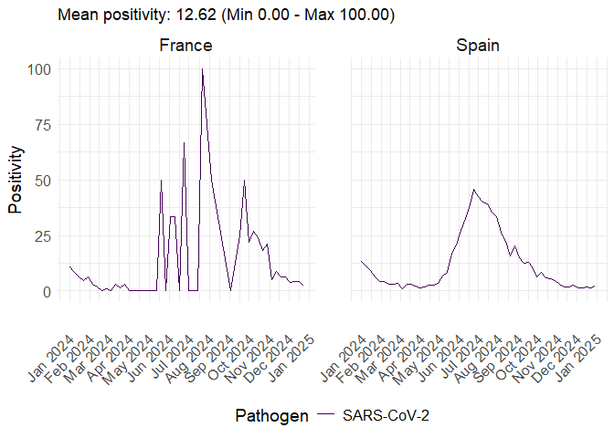

<!-- README.md is generated from README.Rmd. Please edit that file -->

# ervissexplore

<!-- badges: start -->

<!-- badges: end -->

An R package to easily retrieve ERVISS (European Respiratory Virus
Surveillance Summary) data from the EU-ECDC. Provides functions to
fetch, filter, and optionally visualize respiratory virus positivity
rates and SARS-CoV-2 variant proportions across European countries.

## Installation

``` r
install.packages("pak")
pak::pak("Epiconcept-Paris/ervissexplore")
```

## Quick Start

``` r
library(ervissexplore)

# Retrieve SARS-CoV-2 positivity data
positivity_data <- get_sentineltests_positivity(
  date_min = as.Date("2024-01-01"),
  date_max = as.Date("2024-12-31"),
  pathogen = "SARS-CoV-2",
  countries = c("France", "Germany", "Italy")
)

# Retrieve variant data
variant_data <- get_erviss_variants(
  date_min = as.Date("2024-06-01"),
  date_max = as.Date("2024-12-31"),
  variant = c("XFG", "LP.8.1")
)

# The data is ready for your own analysis
head(positivity_data)
#>                 survtype countryname yearweek   pathogen pathogentype
#>                   <char>      <char>   <char>     <char>       <char>
#> 1: primary care sentinel      France 2024-W52 SARS-CoV-2   SARS-CoV-2
#> 2: primary care sentinel      France 2024-W51 SARS-CoV-2   SARS-CoV-2
#> 3: primary care sentinel      France 2024-W50 SARS-CoV-2   SARS-CoV-2
#> 4: primary care sentinel      France 2024-W49 SARS-CoV-2   SARS-CoV-2
#> 5: primary care sentinel      France 2024-W48 SARS-CoV-2   SARS-CoV-2
#> 6: primary care sentinel      France 2024-W47 SARS-CoV-2   SARS-CoV-2
#>    pathogensubtype  indicator    age value       date
#>             <char>     <char> <char> <num>     <Date>
#> 1:      SARS-CoV-2 positivity  total   2.1 2024-12-23
#> 2:      SARS-CoV-2 positivity  total   4.1 2024-12-16
#> 3:      SARS-CoV-2 positivity  total   4.1 2024-12-09
#> 4:      SARS-CoV-2 positivity  total   3.8 2024-12-02
#> 5:      SARS-CoV-2 positivity  total   6.2 2024-11-25
#> 6:      SARS-CoV-2 positivity  total   6.4 2024-11-18
summary(variant_data)
#>    survtype          datasource        countryname          yearweek        
#>  Length:4           Length:4           Length:4           Length:4          
#>  Class :character   Class :character   Class :character   Class :character  
#>  Mode  :character   Mode  :character   Mode  :character   Mode  :character  
#>                                                                             
#>                                                                             
#>                                                                             
#>    pathogen           variant           indicator             age           
#>  Length:4           Length:4           Length:4           Length:4          
#>  Class :character   Class :character   Class :character   Class :character  
#>  Mode  :character   Mode  :character   Mode  :character   Mode  :character  
#>                                                                             
#>                                                                             
#>                                                                             
#>      value           date           
#>  Min.   :0.10   Min.   :2024-10-28  
#>  1st Qu.:0.10   1st Qu.:2024-10-28  
#>  Median :0.55   Median :2024-10-31  
#>  Mean   :0.60   Mean   :2024-10-31  
#>  3rd Qu.:1.05   3rd Qu.:2024-11-04  
#>  Max.   :1.20   Max.   :2024-11-04
```

## Data Source

The package fetches data directly from the [EU-ECDC Respiratory Viruses
Weekly Data](https://github.com/EU-ECDC/Respiratory_viruses_weekly_data)
repository.

Two data types are available:

- **Positivity**: Test positivity rates by pathogen and country (from
  `sentinelTestsDetectionsPositivity.csv`)

- **Variants**: SARS-CoV-2 variant proportions by country (from
  `variants.csv`)

### Latest Data vs Snapshots

By default, functions fetch the latest available data:

``` r
# Latest data (default)
data <- get_sentineltests_positivity(
  date_min = as.Date("2024-01-01"),
  date_max = as.Date("2024-12-31")
)
```

For reproducibility, you can use historical snapshots:

``` r
# Use a specific snapshot for reproducible analyses
data <- get_sentineltests_positivity(
  date_min = as.Date("2023-01-01"),
  date_max = as.Date("2023-12-31"),
  use_snapshot = TRUE,
  snapshot_date = as.Date("2024-02-23")
)
```

## Main Functions

### Data retrieval

| Function                         | Description                      |
|----------------------------------|----------------------------------|
| `get_sentineltests_positivity()` | Fetch and filter positivity data |
| `get_erviss_variants()`          | Fetch and filter variant data    |

### Visualization (optional)

| Function                         | Description                         |
|----------------------------------|-------------------------------------|
| `plot_erviss_positivity()`       | Plot positivity data                |
| `plot_erviss_variants()`         | Plot variant data                   |
| `quick_plot_erviss_positivity()` | Fetch + plot positivity in one call |
| `quick_plot_erviss_variants()`   | Fetch + plot variants in one call   |

### URL builders

| Function                             | Description                 |
|--------------------------------------|-----------------------------|
| `get_sentineltests_positivity_url()` | Get URL for positivity data |
| `get_erviss_variants_url()`          | Get URL for variant data    |

## Examples

### Retrieve and analyze data

``` r
# Get positivity data (returns a data.table)
data <- get_sentineltests_positivity(
  date_min = as.Date("2024-01-01"),
  date_max = as.Date("2024-06-30"),
  pathogen = c("SARS-CoV-2", "Influenza"),
  countries = c("France", "Spain", "Italy")
)

# Your own analysis with data.table syntax
data[,
  .(
    mean_positivity = mean(value, na.rm = TRUE),
    max_positivity = max(value, na.rm = TRUE)
  ),
  by = .(countryname, pathogen)
]
#>    countryname   pathogen mean_positivity max_positivity
#>         <char>     <char>           <num>          <num>
#> 1:      France  Influenza       19.223077           58.7
#> 2:      France SARS-CoV-2        8.942308           66.7
#> 3:       Italy  Influenza       12.670588           40.5
#> 4:       Italy SARS-CoV-2        2.247059           10.4
#> 5:       Spain  Influenza        7.361538           43.7
#> 6:       Spain SARS-CoV-2       10.626923           45.6
```

### Visualization

``` r
# Option 1: Separate steps (more control)
data <- get_sentineltests_positivity(
  date_min = as.Date("2024-01-01"),
  date_max = as.Date("2024-06-30"),
  pathogen = "SARS-CoV-2",
  countries = c("France", "Spain")
)
plot_erviss_positivity(data, date_breaks = "1 month")
```


``` r

# Option 2: Quick one-liner
quick_plot_erviss_positivity(
  date_min = as.Date("2024-01-01"),
  date_max = as.Date("2024-12-31"),
  pathogen = "SARS-CoV-2",
  date_breaks = "1 month",
  countries = c("France", "Spain")
)
```



### Using a local CSV file

``` r
# If you have downloaded the data locally
data <- get_erviss_variants(
  csv_file = "path/to/local/variants.csv",
  date_min = as.Date("2024-01-01"),
  date_max = as.Date("2024-12-31")
)
```

## Contributing to `{ervissexplore}`

New contributors are welcome !

You can contribute to the package in many ways:

- By reporting bugs, issues or feature requests: please open an issue on
  the [GitHub
  repository](https://github.com/Epiconcept-Paris/ervissexplore/issues).
- By fixing bugs or improving the package: please clone or fork the
  repository, work on a dedicated branch and create a pull request.
